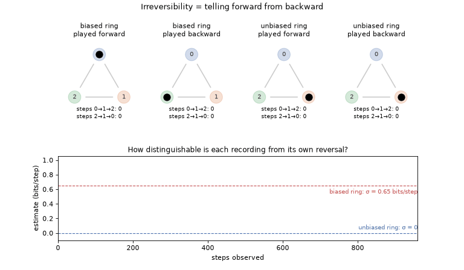
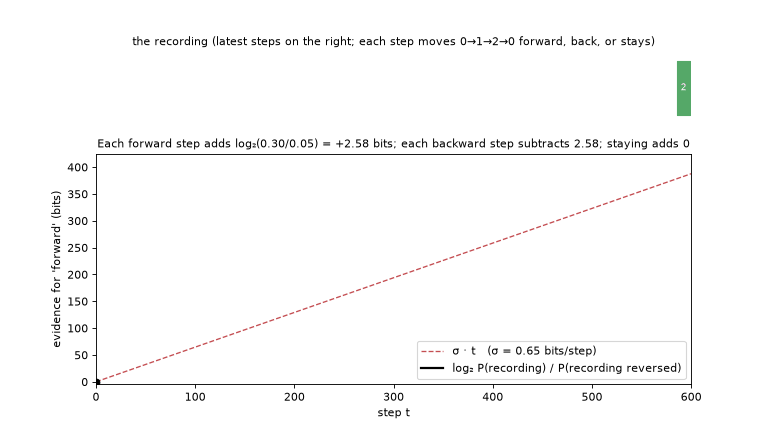
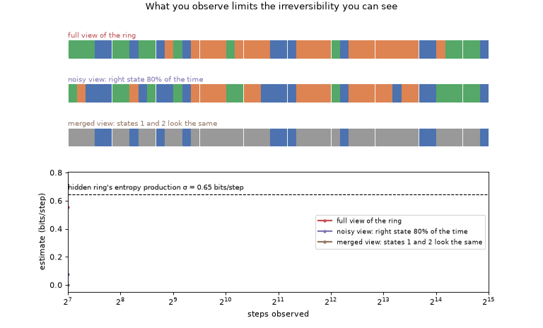
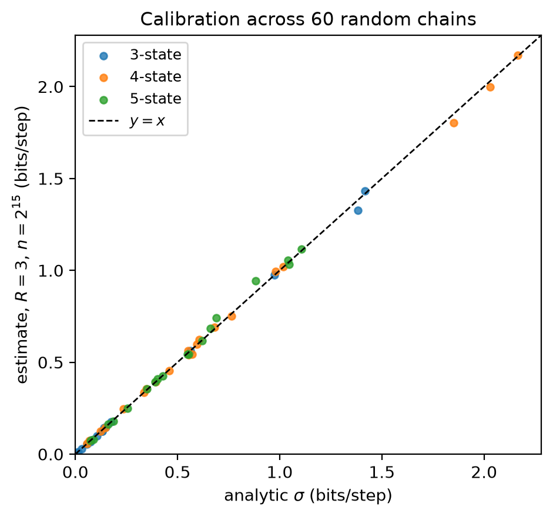
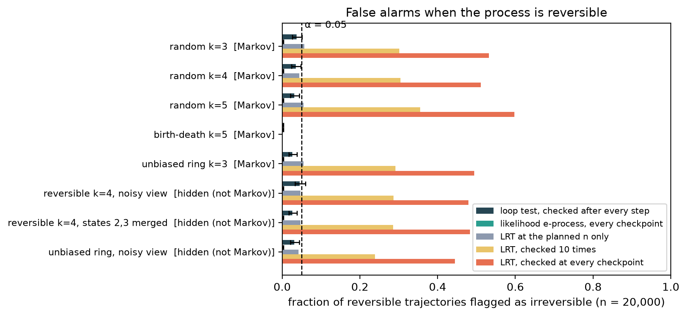

# Evidence Holonomy (uec-holonomy)

[](https://github.com/jbwinters/Evidence-Holonomy/actions/workflows/ci.yml)

Detect and measure irreversibility (broken detailed balance) from a single
discrete trajectory.

- **Test, as data arrive.** `uec.sequential` provides tests of detailed
  balance that stay valid when checked after every observation. The
  loop-orientation test bets on the direction of each loop the chain makes;
  under equilibrium every direction is a fair coin.
- **Measure.** `uec.holonomy` estimates the relative-entropy rate
  D(P‖P_rev) between a process and its time reversal. For a stationary
  Markov chain this equals the entropy production rate σ.

The paper ([`uec_theory.pdf`](uec_theory.pdf), source
[`uec_theory.tex`](uec_theory.tex)) shows that no test can detect broken
detailed balance faster than ρ bits per step, the divergence to the nearest
reversible chain; this is at most σ/2, and about σ/4 near equilibrium. It
presents tests that reach or approach that rate, with seeded experiments.
The estimator and the earlier "evidence holonomy" framing are in its
appendices.



*A process is irreversible when a recording of it can be told apart from the
same recording played backward. The biased ring mostly steps 0→1→2, so its
reversal visibly runs the other way, and the estimate settles near its
entropy production σ = 0.65 bits/step. The unbiased ring looks the same either
way, and the estimate falls to 0.*

## How it works

The evidence that a recording runs forward is the log-likelihood ratio
log₂ P(recording) / P(recording reversed). For a Markov chain, each step
adds a fixed amount, so the total grows linearly, and its slope is the
entropy production rate:



The animation uses the true transition probabilities. The estimator has to
learn them from the recording itself, which is what the rest of the package does.

What you can measure depends on what you observe. Watching the same hidden
ring through a noisy sensor reveals only part of its irreversibility. Merging
two of its states hides it completely, because the merged record looks the
same backward. An observed record can only understate the hidden entropy
production:



## What the estimator is

`klrate_holonomy_time_reversal_markov(x, k, R)` fits two Krichevsky–Trofimov
mixtures over Markov orders 0…R: one to the sequence, one to its literal time
reversal. It then scores the sequence under both. The difference in code
length per symbol estimates D(P‖P_rev).

- **Markov chains, R ≥ 1:** consistent for σ. Estimates for different R ≥ 1
  nearly coincide, because the mixture weights concentrate on the true order.
- **Hidden-state records:** estimates the observed process's order-R
  irreversibility, which can be far below the hidden σ, and is zero when the
  observation is symmetric under reversal.
- **Finite samples:** both models are scored on the data they were fitted to,
  so estimates carry a small positive bias. For reversible chains it shrinks
  roughly as 1/n. Use `uec.battery.bootstrap_klrate` for intervals.

The paper's Section 4 gives the precise statements.

**Prior work.** None of this is a new estimator. The identity between
entropy production and the forward/reverse relative-entropy rate is due to
Gaspard (2004). Estimating it from one trajectory, including with
compression, follows Roldán & Parrondo (2010, 2012). Universal
hitting/waiting-time estimators come from Chazottes & Redig (2005) and
Cristadoro et al. (2023). What this repository adds is a tested
implementation, a careful account of when the estimate can be trusted, and
the loop framing in the paper. The paper's "Related work" section has full
references. On 60 random chains, the
estimates at n = 2¹⁵ track the analytic σ closely (r = 0.9994):



## Testing for equilibrium as data arrive

The paper's main result; a longer research note with the full evidence
trail is [`docs/anytime_reversibility_test.md`](docs/anytime_reversibility_test.md).
It develops tests of detailed balance that stay valid when checked after
every observation. It covers three results:

- the optimal detection rate, which is ρ (the distance to the nearest
  reversible chain), not the entropy production σ;
- a likelihood e-process that attains that rate;
- a simple loop-orientation test (`uec.sequential.loop_eprocess_reversibility`).
  Near equilibrium it needs 1.7–1.9× the sample size of an idealized
  fixed-sample test, while a classical test checked repeatedly raises
  false alarms 24–60% of the time.



## Install

```bash
git clone https://github.com/jbwinters/Evidence-Holonomy.git
cd Evidence-Holonomy
pip install -e ".[dev]"      # tests and lint
pip install -e ".[audio]"    # SciPy WAV reader
pip install -e ".[image]"    # Pillow, for images
pip install -e ".[video]"    # imageio + ffmpeg, for video
pip install -e ".[all]"      # every optional dependency
```

Requires Python 3.9+. The package is not on PyPI.

## Python API

```python
from uec.markov import random_markov_biased, sample_markov, entropy_production_rate_bits
from uec.holonomy import klrate_holonomy_time_reversal_markov

T = random_markov_biased(k=3, delta=0.6)
x = sample_markov(T, n=150_000)
print(entropy_production_rate_bits(T))                # analytic sigma, bits/step
print(klrate_holonomy_time_reversal_markov(x, k=3, R=3))  # estimate from x
```

Other entry points:

- `uec.holonomy.klrate_holonomy_general`: any loop of transforms from `uec.transforms`.
- `uec.holonomy.klrate_holonomy_leadlag_markov`: the same estimator at time scale τ.
- `uec.aot.aot_from_series`: arrow-of-time analysis for real-valued series.
- `uec.adapters`: tokenizers for images and video.
- `uec.bio`: surrogates and conditional analyses (experimental).

## Command line

### `uec-battery`: validate the estimator

```bash
uec-battery                        # one random chain: analytic EP vs estimate
uec-battery --core --fast          # core checks (under a minute)
uec-battery --run_suite            # full battery (about 6 minutes)
```

The battery checks:

- gauge invariance (≈ 0)
- time reversal against analytic EP: random chains, closed-form rings, reversible and low/high-EP chains
- agreement with a count-based estimator
- robustness to R
- bootstrap coverage
- negative controls

Each check writes a JSON record under `results/` and stops the run if it fails.

### `uec-aot`: arrow of time in real data

```bash
# Audio (first differences, 32 quantile bins, order 5)
uec-aot --aot_wav data/wav/420228__14fpanska_nemec_petr__37-17-boiling-water.wav \
        --aot_bins 32 --aot_win 65536 --aot_stride 32768 --order 5 --aot_diff --seed 1

# Time series in a CSV column, as log-returns
uec-aot --aot_csv prices.csv --aot_csv_col Close --aot_logreturn --seed 1

# Images and video
uec-aot --aot_image image.png --image_mode raster --aot_bins 16
uec-aot --aot_video video.mp4 --video_vq_k 64 --video_down 16 --aot_win 512 --aot_stride 256

# Many files at once
uec-aot --scoreboard_glob "data/wav/*.wav" --aot_diff --scoreboard_csv scoreboard.csv
```

The first half of the series trains the forward model and its reversal. The
second half is split into windows, and each window is compared with its own
reversal. The output reports:

- **AUC:** the probability that a forward window looks more "forward" than a
  reversed one, with a 95% block-bootstrap interval. 0.5 means no detectable
  arrow of time. Values toward 1 mean the direction is detectable. Values
  well below 0.5 point to an artifact, not to reversibility. Single-run AUCs
  are noisy at small sizes: for i.i.d. noise with 10⁴ samples we observed
  AUCs from 0.11 to 0.74 across seeds. Read the interval, not the point.
- **bits/step:** the KL-rate estimate on the held-out half, with a bootstrap interval.
- **bits/s:** bits/step × the sampling rate. This is a property of the
  quantized record, not a physical entropy production of the sound source.

[`docs/data.md`](docs/data.md) explains how to fetch data and choose settings.
Audio samples under `data/wav/` come from Freesound; see
[`ATTRIBUTIONS.md`](ATTRIBUTIONS.md). `scripts/generate_test_wav.py` and
`scripts/generate_test_videos.py` create synthetic test signals.

## Reproducing the paper

```bash
pip install -e ".[paper]"
scripts/reproduce_all.sh
```

This regenerates:

- `anc/*.csv` (via `scripts/paper_experiments.py`)
- `tables/`
- `figures/`
- `uec_theory.pdf`, when LaTeX is installed

Every number and figure in the paper comes from these files. The README
animations come from `scripts/make_animations.py`.
`scripts/package_arxiv.sh` builds an arXiv source bundle.

## Repository layout

```
src/uec/            package: markov, coders, transforms, holonomy, aot, adapters, bio, battery, cli
tests/              pytest suite (run: pytest -q)
scripts/            paper experiments, tables, figures, packaging, test-signal generators
scripts/analysis/   diagnostics for real data (gauge, surrogate, Markov, ergodicity checks)
anc/, tables/, figures/   paper data, tables, and figures
experiments/quantum/      exploratory quantum-channel simulations (not part of the paper)
docs/               assumptions and practical checks, data guide, diagnostics plan
background/         motivation, related work, and speculative notes
data/wav/           small audio samples for demos
```

## Development

```bash
pip install -e ".[dev,audio,image,ml]"
ruff check src tests
pytest -q
```

CI runs both on Python 3.9–3.12. Before trusting a result on real data, read
[`docs/assumptions.md`](docs/assumptions.md). It covers the assumptions
(finite alphabet, stationarity, ergodicity, enough data for the chosen order,
absolute continuity) and how to check each one.

## License

Code: MIT. Text, figures, and other non-code content: CC BY 4.0. See [`LICENSE`](LICENSE).
