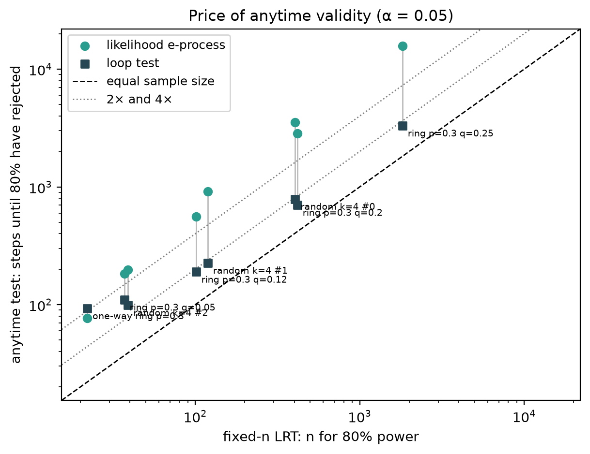
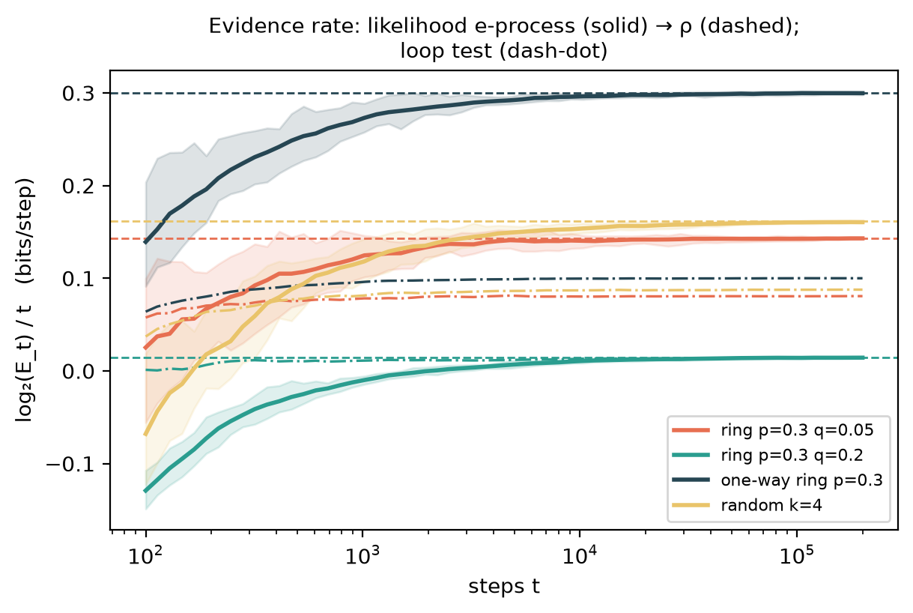
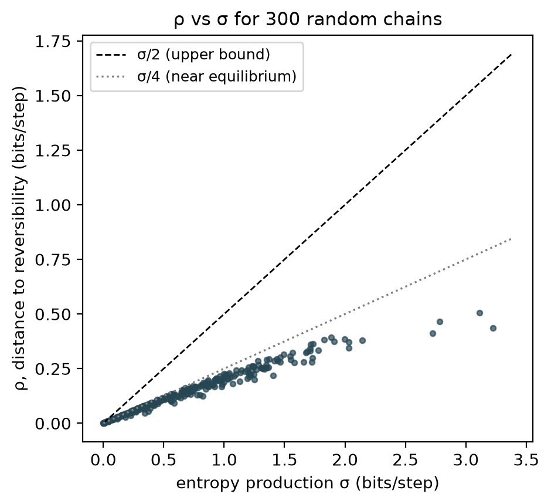

# Anytime-valid tests of time-reversal symmetry

*Research note, September 2026. Code: `src/uec/sequential.py`. Experiments:
`scripts/sequential_experiments.py` → `anc/seq_*.csv`. Figures:
`scripts/plot_sequential.py` → `figures/seq_*`. An independent adversarial
review of the proofs and code was carried out before the final runs; its
findings are addressed below.*

## Summary

Is a system in equilibrium, or is it being driven? A driven stationary
Markov chain breaks detailed balance, and its trajectories look different
when played backward. Existing methods estimate the entropy production σ
from a recording and ask whether it is clearly above zero.

The trouble is that people check as the data come in. A classical
likelihood-ratio test that is correct at a planned sample size stops being
correct when it is checked repeatedly: in our runs on reversible chains its
false-alarm rate rose from 5% to 24–36% when checked 10 times and 44–60% when checked at every checkpoint.

This note contributes three things.

1. **The optimal detection rate.** Against the composite null "some
   reversible chain", no sequential test can collect evidence faster than

       ρ = Σ_ij f_ij log2( 2 f_ij / (f_ij + f_ji) ),     f_ij = π_i T_ij,

   bits per step. This is the divergence to the nearest reversible chain.
   It is not σ: ρ ≤ σ/2, ρ ≈ σ/4 near equilibrium, and ρ stays finite when σ
   is infinite. This yields a lower bound of about log2(1/α)/ρ on the
   expected detection time of any level-α sequential test.
2. **A likelihood e-process that attains ρ.** It uses the running-MLE
   universal-inference construction. It is valid at every sample size and
   grows at exactly rate ρ. Its model-selection overhead makes it slow at
   practical α, though.
3. **A loop-orientation test.** Under detailed balance, every loop the
   chain makes is as likely as its reversal, so each loop's direction is a
   fair coin. Betting on loop directions gives a test with exact validity
   under continuous monitoring, no constrained optimization, and little
   overhead. Near equilibrium, the hard regime, it captures 92–100% of
   the optimal rate ρ.

Headline numbers:

- **False alarms.** Monitored after every step on reversible chains, the
  loop test rejected 2.6–4.5% (0% on a tree-shaped chain, where every loop is its own reversal) of trajectories at α = 0.05.
- **Speed.** On irreversible chains it needed 1.7–1.9× near equilibrium and 2.5–4.2× far from it times as
  many steps as a fixed-sample test. That comparison test is calibrated by
  simulation and given the true chain's sample size for 80% power, which no
  real experiment has. The likelihood e-process needed 3.5–8.7×
  times as many.

## Setup

Observe x_0, x_1, … from a stationary first-order Markov chain on k states,
with transition matrix T and stationary law π.

- **Null hypothesis H0:** detailed balance, π_i T_ij = π_j T_ji, from any
  initial state.
- **Time reversal:** T*_ij = π_j T_ji / π_i.
- **Entropy production:** σ = Σ f_ij log2(f_ij / f_ji).

## How fast can irreversibility be detected?

**Lemma 1 (nearest reversible chain).** Among reversible transition
matrices Q, the KL rate D_π(T‖Q) = Σ f_ij log(T_ij/Q_ij) is minimized by the
additive reversiblization M = (T + T*)/2, and the minimum is ρ.

This is the m-projection of Wolfer & Watanabe (2021, Thm. 6.1). Andrieux
(2025) also identifies M as the closest equilibrium dynamics. A short
argument:

1. Write g for the symmetric edge measure of Q, with marginal μ. Then
   D_π(T‖Q) = KL(f‖g) − KL(π‖μ).
2. Let s = (f + fᵀ)/2, which is symmetric with marginal π. Because
   log(s/g) is symmetric, KL(f‖g) = KL(f‖s) + KL(s‖g).
3. By data processing, KL(s‖g) ≥ KL(π‖μ).
4. So D_π(T‖Q) ≥ KL(f‖s) = ρ, with equality at g = s, that is, Q = M.

**Properties of ρ.**
- ρ ≤ σ/2, by convexity of KL in its second argument.
- ρ ≤ Σ_{i≠j} f_ij bits, since each term is at most f_ij bits. So ρ is
  finite even when some transitions are one-way and σ = ∞.
- Near equilibrium, write f_ij = s_ij + a_ij and f_ji = s_ij − a_ij. The pair
  contributes about a²/s to ρ and about 4a²/s to σ, so ρ ≈ σ/4.

**Proposition 2 (no test can do better).** Let T be irreversible and the
chain stationary.

- (a) Any e-process valid under H0 satisfies E_P[log2 E_t] ≤ tρ.
- (b) Any sequential test with level α under H0 and power 1 − β against T
  satisfies E_P[τ] ≥ (d(1−β‖α) − c_T)/ρ, where d is the binary KL divergence
  and c_T is a constant depending on T only. For small α and β this is
  ≈ log2(1/α)/ρ.

*Proof sketch.* The stationary chain M lies in H0: it is reversible,
shares π, and the null allows any initial state.
- (a) Gibbs' inequality gives E_P[log E] ≤ D(P‖M) + log E_M[E] ≤ D(P‖M), and
  D(P_t‖M_t) = tρ exactly.
- (b) Data processing on the stopped path gives D(P_τ‖M_τ) ≥ d(1−β‖α).
  Wald's identity for the Markov additive log-likelihood ratio (mean ρ per
  step, Poisson-equation correction bounded by c_T, assuming E_P[τ] < ∞)
  gives D(P_τ‖M_τ) ≤ ρ E_P[τ] + c_T. ∎

*Why ρ and not σ.* Roldán et al. (2015) use Wald's sequential probability
ratio test to decide the arrow of time. Their null hypothesis is the
chain's own time reversal, a single fully specified process, and evidence
accrues at rate σ. Here the null is composite, "some reversible chain", and
the least favourable member is M, not T*. Testing "is this system in
equilibrium at all?" without knowing which equilibrium it would be is
therefore slower: ρ ≤ σ/2.

## Test 1: likelihood e-process

    E_t = Π_{s=1..t} q_{s-1}(x_s | x_{s-1})  /  sup_{T reversible} Π_{s=1..t} T(x_{s-1}, x_s)

- **Numerator:** a Krichevsky–Trofimov predictor using only earlier
  transitions.
- **Denominator:** the reversible maximum likelihood, computed by the
  standard self-consistent iteration X_ij ← (C_ij + C_ji)/(N_i/x_i + N_j/x_j).
  The problem has a convex reformulation (Trendelkamp-Schroer et al. 2015).

This is the running-MLE universal-inference construction of Wasserman,
Ramdas & Balakrishnan (2020).

**Proposition 3 (validity).** Under H0, P(∃ t : E_t ≥ 1/α) ≤ α, for any
initial state. E_t is an e-process.

*Proof.* The denominator is at least the likelihood under the true
reversible T0. So E_t is bounded by a nonnegative martingale with mean 1.
Apply Ville's inequality. ∎

**Numerical caveat.** The iteration is stopped by a relative-change rule,
not a certified optimality gap. The review compared it with multi-start
BFGS on 150 random count matrices: it fell short of the optimum by at most
1.5×10⁻⁴ nats. That would inflate E by at most a factor of about 1.00015.
`tests/test_sequential.py` checks agreement with a generic optimizer to
10⁻³ nats.

**Proposition 4 (growth).** For an irreducible T, log2(E_t)/t → ρ almost
surely.

*Proof sketch.*
- The KT numerator is within (k(k−1)/2) log2 t + O(k) bits of the
  unconstrained maximum likelihood.
- The count frequencies converge to f.
- The maximized log-likelihoods converge to Σ f log T and
  max_{Q rev} Σ f log Q; this uses continuity of the reversible maximum in
  the frequencies, including zero-count edges.
- Their difference is ρ by Lemma 1. ∎

So Test 1 is growth-rate optimal. Its detection time is roughly
[log2(1/α) + (k(k−1)/2) log2 τ]/ρ. The second term is the price of
predicting all transition probabilities while the denominator fits the
symmetric part for free. At α = 0.05 that term dominates. The formula overpredicts the observed
median detection times by a factor of 1.2–1.9, but it identifies where the
cost comes from.

## Test 2: loop orientation

Time is counted in transitions: step t is the transition x_{t−1} → x_t.
Let B = 10·k, where k is the number of states. For k = 3 that is 30 steps.

1. **Estimate.** Keep transition counts C over all transitions observed so
   far, including the burn-in. The Krichevsky–Trofimov estimate is
   q(j | i) = (C_ij + ½) / (N_i + k/2), where N_i = Σ_j C_ij and self-transitions
   count like any other.
2. **Reference state.** r is the most frequent state among x_0, …, x_B,
   with ties going to the lowest index. It is fixed from then on.
3. **Loops.** The first loop starts at the first time t ≥ B with x_t = r
   (possibly t = B). Each later return to r closes the current loop and
   starts the next. Transitions before the first loop start are used only
   for the counts.
4. **Frozen estimate.** When a loop starts at time t_0, freeze q using the
   counts of transitions 1, …, t_0, that is, strictly before the loop's
   first step.
5. **Update.** When a loop e = (r, y_1, …, y_{m−1}, r) closes, multiply E by

       2 q(e) / (q(e) + q(ē)),    q(e) = Π q(y_{s+1} | y_s),    q(ē) = Π q(y_s | y_{s+1}),

   using the frozen estimate. The products run over the loop's transitions
   and their reversals. Palindromic loops, including a self-loop r → r,
   give a factor of exactly 1.
6. **Decision.** Reject reversibility the first time E ≥ 1/α. The test may
   be checked after every step.

**Proposition 5 (validity).** Under H0, P(∃ t : E_t ≥ 1/α) ≤ α.

*Proof.*
- By the strong Markov property, each loop is independent of everything
  before its start, given the start. That includes r's selection, which
  uses only x_0, …, x_B, and the frozen estimate.
- By Kolmogorov's criterion, P(e) = P(ē) for every loop under detailed
  balance.
- So, given the unordered pair {e, ē} and the past, the orientation is a
  fair coin. Each factor then has conditional mean q(e)/(q(e)+q(ē)) +
  q(ē)/(q(e)+q(ē)) = 1.
- Indexed by completed loops, E is a nonnegative martingale with mean 1.
  It is constant between completions, so its supremum over all steps equals
  its supremum over completions.
- Ville's inequality finishes the proof. ∎

**What is not claimed.** Test 2's E_t is not an e-process with respect to
step-level stopping times. The reviewer exhibited a stopping rule that looks
inside an open loop and gives E[E_τ] ≈ 1.18. The guarantee is the one above:
a level-α test that may be checked after every step. For the same reason, an
earlier draft's average over all reference states is not claimed valid: the
per-state processes live on different clocks. That draft showed no violation
empirically, but it has no proof.

**Efficiency.** The oracle evidence per loop is
E[log2(2P(e)/(P(e)+P(ē)))]. Divided by the mean loop length, this is at most
ρ, by Proposition 2(a).

| Chain | ρ (bits/step) | Loop-test rate | Efficiency |
|---|---|---|---|
| ring p=0.3 q=0.25 | 0.0033 | 0.0033 ± 0.0001 | 1.00 ± 0.02 |
| ring p=0.3 q=0.2 | 0.0145 | 0.0136 ± 0.0003 | 0.94 ± 0.02 |
| random k=4 #0 | 0.0189 | 0.0174 ± 0.0004 | 0.92 ± 0.02 |
| ring p=0.3 q=0.12 | 0.0575 | 0.0458 ± 0.0009 | 0.80 ± 0.02 |
| random k=4 #1 | 0.0599 | 0.0480 ± 0.0010 | 0.80 ± 0.02 |
| ring p=0.3 q=0.05 | 0.1429 | 0.0809 ± 0.0009 | 0.57 ± 0.01 |
| random k=4 #2 | 0.1937 | 0.1116 ± 0.0015 | 0.58 ± 0.01 |
| one-way ring p=0.3 | 0.3000 | 0.1014 ± 0.0006 | 0.34 ± 0.00 |

*Oracle rate with the most visited reference state (the one the test
selects), by simulation of up to 606,000 loops per chain
(`anc/seq_loop_efficiency.csv`).*

Near equilibrium, most of the evidence is in loop orientations, and Test 2
is nearly optimal. Far from equilibrium it discards within-loop information,
but those chains are detected in tens of steps anyway.

## Evidence

All runs are seeded; `scripts/sequential_experiments.py` regenerates every
number below. α = 0.05 throughout.

### False alarms on reversible processes

1,000 trajectories of 20,000 steps per setting. The loop test is checked
after every step. The likelihood e-process and the LRT are checked at
about 300 checkpoints: every step up to 64, then a geometric grid.
Brackets are 95% Clopper–Pearson intervals.

| Reversible setting | Loop test | Likelihood e-process | LRT at planned n | LRT, 10 looks | LRT, every checkpoint |
|---|---|---|---|---|---|
| random k=3 (Markov) | 3.7% [2.6, 5.1] | 0.0% | 5.7% | 30.1% | 53.2% |
| random k=4 (Markov) | 3.5% [2.4, 4.8] | 0.0% | 4.4% | 30.4% | 51.1% |
| random k=5 (Markov) | 3.1% [2.1, 4.4] | 0.0% | 5.5% | 35.5% | 59.8% |
| birth-death k=5 (Markov) | 0.0% [0.0, 0.4] | 0.0% | n/a | n/a | n/a |
| unbiased ring k=3 (Markov) | 2.6% [1.7, 3.8] | 0.0% | 5.5% | 29.1% | 49.4% |
| reversible k=4, noisy view (hidden) | 4.5% [3.3, 6.0] | 0.0% | 4.7% | 28.7% | 47.9% |
| reversible k=4, states 2,3 merged (hidden) | 2.6% [1.7, 3.8] | 0.0% | 4.7% | 28.6% | 48.3% |
| unbiased ring, noisy view (hidden) | 3.1% [2.1, 4.4] | 0.0% | 4.2% | 23.9% | 44.5% |

- **Both anytime tests hold their level.** The likelihood e-process raised
  no false alarms in 8,000 runs. It is very conservative, which is
  consistent with its slow detection.
- **The birth-death chain lives on a tree.** Every loop there traverses
  each edge equally often in both directions, so every factor is exactly 1.
  That is correct: chains on trees are always reversible.
- **Hidden-state records stay within α,** although no proposition covers
  them.

### Detection on irreversible chains

400 trajectories per chain, started from the stationary distribution, with
time counted from x_0 including the burn-in. Detection-time medians and
80th percentiles carry Monte Carlo error of roughly ±8% at 400
trajectories. The comparison is a fixed-n likelihood-ratio
test with critical values calibrated by simulating 1,000 trajectories of
the least favourable reversible chain M. Its sample size is the smallest n
with 80% power against the true chain, so it knows the answer in advance.

The asymptotic χ² cutoffs understate that n by up to 36% for the easiest
chains (`anc/seq_detection.csv`). "80%" for the anytime tests is the step
by which 80% of trajectories had rejected.

| Chain | ρ | Fixed-n LRT, n for 80% power | Loop test: median / 80% | Likelihood e-process: 80% | Floor log₂(20)/ρ |
|---|---|---|---|---|---|
| ring p=0.3 q=0.25 | 0.0033 | 1818 | 1907 / 3308 (1.8×) | 15686 (8.6×) | 1316 |
| ring p=0.3 q=0.2 | 0.0145 | 417 | 407 / 701 (1.7×) | 2834 (6.8×) | 298 |
| random k=4 #0 | 0.0189 | 405 | 436 / 789 (1.9×) | 3539 (8.7×) | 229 |
| ring p=0.3 q=0.12 | 0.0575 | 101 | 123 / 190 (1.9×) | 557 (5.5×) | 75 |
| random k=4 #1 | 0.0599 | 119 | 146 / 226 (1.9×) | 913 (7.7×) | 72 |
| ring p=0.3 q=0.05 | 0.1429 | 37 | 91 / 110 (3.0×) | 184 (5.0×) | 30 |
| random k=4 #2 | 0.1937 | 39 | 83 / 99 (2.5×) | 198 (5.1×) | 22 |
| one-way ring p=0.3 | 0.3000 | 22 | 82 / 93 (4.2×) | 77 (3.5×) | 14 |

- **Near equilibrium** (ρ < 0.07), the loop test needs 1.7–1.9× the
  fixed-sample size, and its median detection time roughly matches that
  size. This is the typical price of anytime validity. It is paid once and
  buys the right to look at every step.
- **Far from equilibrium** the ratio rises to 2.5–4.2×. Two causes: the
  30–40 step burn-in, and the discarded within-loop information (efficiency
  0.34–0.58). In absolute terms these chains are detected in about 100 steps.
- **The likelihood e-process needs 3.5–8.7×.** Its overhead term
  (k(k−1)/2) log₂ τ explains why. The simple formula
  [log₂(1/α) + (k(k−1)/2) log₂ τ]/ρ overpredicts the observed medians by a
  factor of 1.2–1.9, but it identifies the cause.
- **No detection time falls below the floor** log₂(20)/ρ of Proposition 2,
  as the proposition requires. The floor bounds expected times; the
  medians are also above it in every case.

### Growth rate

20 trajectories of 200,000 steps per chain. The likelihood e-process's
log₂(E_t)/t converges to ρ:

| Chain | ρ | Final rate |
|---|---|---|
| ring q=0.05 | 0.1429 | 0.1430 |
| ring q=0.2 | 0.0145 | 0.0143 |
| one-way ring (σ = ∞) | 0.3000 | 0.2997 |
| random k=4 | 0.1614 | 0.1605 |

The loop test settles at its lower, oracle-predicted rate.

### ρ versus σ

Over 300 random chains, ρ lies below σ/2 and tracks σ/4 near equilibrium,
bending further below it as σ grows.

## Reproduction

An independent agent re-ran the growth, efficiency, and rate experiments
from a copy of the repository and obtained byte-identical CSVs. Working
only from this note, it also reimplemented Test 2 without reading the code:

- **False alarms:** 3.8% [2.5, 5.7] over 600 reversible 4-state
  trajectories, checked after every step.
- **Detection on the q = 0.2 ring:** median 394 and 80th percentile 722
  over 2,400 trajectories, against 407 and 701 here.

Its list of ambiguities in an earlier draft led to the precise
specification above.

## Limitations

- **Markov null.** Both tests assume the null is first-order reversible
  Markov. Records of hidden reversible chains are reversible but not Markov,
  so the propositions do not cover them. For Test 2, excursions of an
  observed state need not regenerate the hidden state. The experiments
  measure false alarms in that setting, but that is evidence, not proof.
- **Higher-order and hidden-state extensions are open.** For Test 2, a
  natural route is loops of a hidden regeneration state or of symbol blocks.
- **A test, not a bound.** The tests certify that detailed balance is
  broken. They do not give a lower confidence bound on σ. Inverting Test 2
  over a family of tilted nulls might give one.
- **Idealized comparison.** The comparison test is idealized: it knows the
  true chain's sample size for 80% power. That makes the ratios
  conservative for the anytime tests.

## References

- Andrieux, "Irreversibility as divergence from equilibrium," J. Stat. Phys. 192, 146 (2025).
- Gaspard, J. Stat. Phys. 117, 599 (2004).
- Grünwald, de Heide & Koolen, "Safe testing," JRSS-B 86, 1091 (2024).
- Jiang, Hlynka, Brill & Cheung, "Reversibility checking for Markov chains," arXiv:1806.10154 (2018).
- Pietzonka, Guioth & Jack, "Cycle counts and affinities in stochastic models of non-equilibrium systems," PRE 104, 064137 (2021).
- Roldán & Parrondo, PRL 105, 150607 (2010); PRE 85, 031129 (2012).
- Roldán, Neri, Dörpinghaus, Meyr & Jülicher, "Decision making in the arrow of time," PRL 115, 250602 (2015).
- Steuber, Kiessler & Lund, "Testing for reversibility in Markov chain data," PEIS 26, 593 (2012).
- Trendelkamp-Schroer, Wu, Paul & Noé, "Estimation and uncertainty of reversible Markov models," J. Chem. Phys. 143, 174101 (2015).
- Wald, *Sequential Analysis* (1947).
- Wasserman, Ramdas & Balakrishnan, "Universal inference," PNAS 117, 16880 (2020).
- Wolfer & Watanabe, "Information geometry of reversible Markov chains," Information Geometry 4, 393 (2021).
